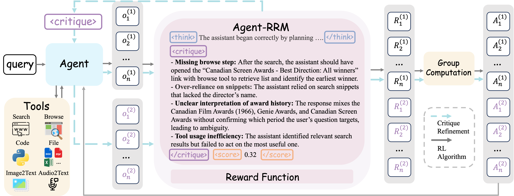
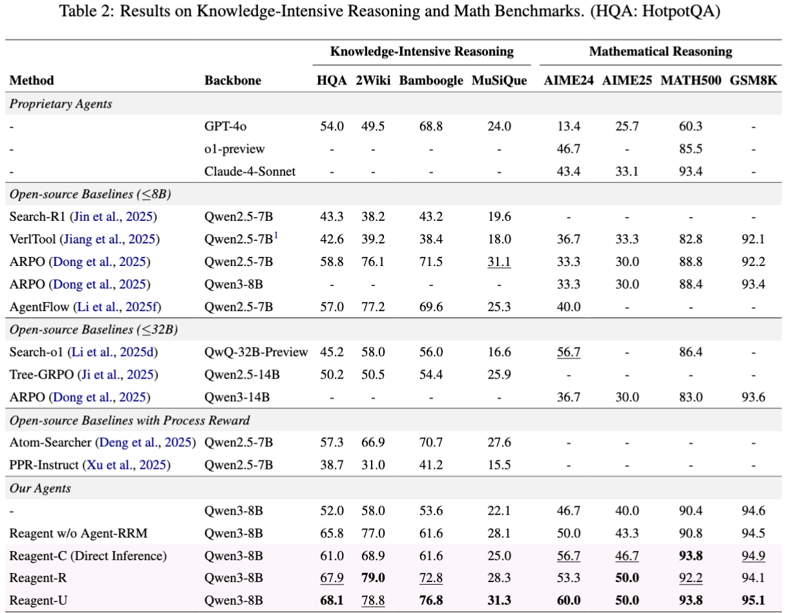

# Reagent: Agentic Reinforcement Learning with Reasoning Reward Model

<p align="center">
  <a href="https://arxiv.org/">[📖paper]</a> &nbsp;&nbsp;
  <a href="https://huggingface.co/bunny127/Reagent">[🤗Reagent model]</a> &nbsp;&nbsp;
  <a href="https://huggingface.co/bunny127/Agent-RRM">[🤗Agent-RRM]</a>
</p>

<p align="center">
<a href="https://huggingface.co/datasets/bunny127/Reagent-SFT-55.6K">[🤗Reagent-SFT-55.6K Dataset]</a> &nbsp;&nbsp;
<a href="https://huggingface.co/datasets/bunny127/Reagent-RL-709K">[🤗Reagent-RL-709K Dataset]</a>
</p>

<p align="center">
<a href="https://huggingface.co/datasets/bunny127/Reagent-RRM-SFT-28K">[🤗Reagent-RRM-SFT-28K Dataset]</a> &nbsp;&nbsp;
<a href="https://huggingface.co/datasets/bunny127/Reagent-RRM-RL-90K">[🤗Reagent-RRM-RL-90K Dataset]</a>
</p>

## Introduction

Agentic Reinforcement Learning (Agentic RL) has achieved notable success in enabling agents to perform complex reasoning and tool use. However, most methods still rely on sparse outcome-based rewards for training, which fail to differentiate intermediate reasoning quality, leading to suboptimal training results.

**Reagent** introduces **Agent Reasoning Reward Model (Agent-RRM)**, a multi-faceted reward model that produces structured feedback for agentic trajectories, including:
- **Explicit reasoning trace**: Step-by-step reasoning analysis
- **Focused critique**: Refinement guidance highlighting reasoning flaws
- **Overall score**: Process performance evaluation

We systematically investigate three integration strategies:
- **Reagent-C**: Text-augmented refinement with critique-based improvements
- **Reagent-R**: Reward-augmented guidance for policy optimization
- **Reagent-U**: Unified feedback integration combining all signals

### Performance Highlights

Extensive evaluations across 12 diverse benchmarks demonstrate substantial performance improvements:
- **GAIA**: 43.7% accuracy
- **WebWalkerQA**: 46.2% accuracy
- Superior results on multi-hop QA and web navigation tasks, mathematical tasks and general agent tasks.

## Framework Overview

<div align="center">
  
  <p><i>Figure: Overview of the Reagent framework showing Agent-RRM structure and training strategies</i></p>
</div>

## Benchmark Performance

We evaluate Reagent across diverse benchmarks covering Knowledge-Intensive Reasoning, Mathematical Reasoning, and General Agent and Search Tasks.

<div align="center">
  
  <p><i>Table 1: Comprehensive Evaluation on General Agent and Search Benchmarks.</i></p>
</div>


<div align="center">
  
  <p><i>Table 2: Results on Knowledge-Intensive Reasoning and Math Benchmarks. (HQA: HotpotQA)</i></p>
</div>

## Quick Start

### Installation

1. **Create and activate conda environment:**
```bash
conda create -n reagent python=3.11
conda activate reagent
```

2. **Install dependencies:**
```bash
pip install -r requirements.txt
```

3. **Install ffmpeg for audio processing:**
```bash
conda install -c conda-forge ffmpeg
```

### Training with Agent-RRM

**Step 1: Setup Agent Reasoning Reward Model**

Start the reward model servers (requires multiple GPUs):
```bash
bash ./examples/reagent/reward_model.sh
```

**Step 2: Prepare Training Data**

Process and prepare the training datasets:
```bash
python ./examples/reagent/prepare_data.py
```

**Step 3: Start Training**

Launch the training process:
```bash
bash ./examples/reagent/train.sh
```

> **Note**: Make sure to configure paths and hyperparameters in the respective shell scripts before training.

## Evaluation

We provide a unified evaluation framework supporting 18 diverse benchmarks with automatic tool and prompt configuration.

### Supported Benchmarks

**Multimodal Tasks:**
- `gaia` - GAIA benchmark with multimodal capabilities
- `gaia_text` - GAIA text-only subset

**Math Reasoning:**
- `math500` - MATH500 benchmark
- `aime24`, `aime25` - AIME competition problems
- `gsm8k` - GSM8K math reasoning

**Multi-hop QA & Web Navigation:**
- `2wiki` - 2WikiMultihopQA
- `hotpotqa` - HotpotQA
- `musique` - MuSiQue
- `bamboogle` - Bamboogle
- `webwalker` - WebWalker
- `hle` - HLE benchmark
- `xbench` - XBench-DeepSearch

### Quick Evaluation

```bash
cd Evaluation/unified_eval

# 1. Configure your settings in run.sh
# Set MODEL_PATH, OUTPUT_PATH, and API keys

# 2. Start vLLM servers (if not already running)
bash start_server.sh

# 3. Run evaluation on any dataset
# Just change the DATASET variable in run.sh
DATASET="gaia"        # For multimodal tasks
# DATASET="math500"   # For math reasoning
# DATASET="xbench"    # For web navigation

bash run.sh
```

### Direct Python Usage

```bash
python3 run_multi_react_py.py \
    --dataset gaia \
    --model /path/to/model \
    --output ./output \
    --max_workers 16 \
    --roll_out_count 3 \
    --temperature 0.6 \
    --auto_judge \
    --judge_engine deepseekchat
```

**Key Features:**
- **Automatic Configuration**: Tools and prompts are automatically configured per dataset
- **Single Codebase**: One set of scripts for all 18 benchmarks
- **Easy Dataset Switching**: Change evaluation target by modifying just one variable
- **Parallel Processing**: Multi-worker support for faster evaluation
- **Auto Judgment**: Built-in automatic answer evaluation

### Calculating Metrics

After evaluation, use `get_score.py` to calculate pass@1 and pass@k metrics:

```bash
cd Evaluation

# Calculate pass@1 for a single result file
python get_score.py --file output/model_name_unified/gaia/iter1.jsonl

# Calculate pass@k across multiple rollouts
python get_score.py --folder output/model_name_unified/gaia/
```

The script will:
- **pass@1**: Calculate accuracy for each individual rollout file
- **pass@k**: Calculate the percentage of questions where at least one rollout succeeded

## Citation

If you find this work helpful, please consider citing:

```bibtex

```


## Acknowledgments

The implementation of this project is built upon [LLaMA-Factory](https://github.com/hiyouga/LlamaFactory), [veRL](https://github.com/volcengine/verl) and [rLLM](https://github.com/rllm-org/rllm). We deeply appreciate these teams for their contributions to the open-source research community.

